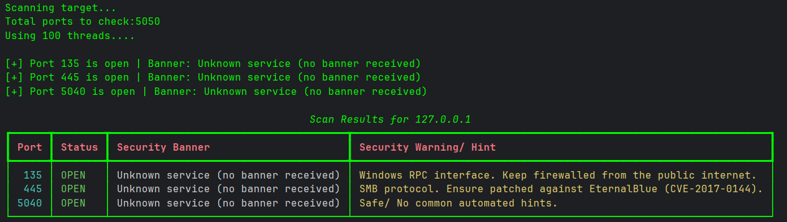
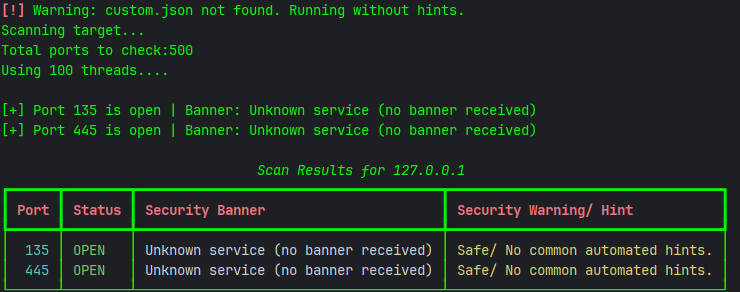

# NetScan 🔍

A lightweight multi-threaded network scanner built in Python.

PavanMap scans TCP ports, performs basic banner grabbing, and provides security hints for commonly exposed services.

## Features

* Multi-threaded TCP port scanning
* Custom port range support
* Banner grabbing for service identification
* Vulnerability/security hints using a JSON database
* Rich terminal output
* Command-line interface using argparse

## Installation

Clone the repository:

```bash
git clone https://github.com/pavan-a53/NetScan.git
cd NetScan
```

Install dependencies:

```bash
pip install rich
```

## Usage

Scan the default port range (1-1024):

```bash
python main.py 127.0.0.1
```

Scan a custom port range:

```bash
python main.py 127.0.0.1 -p 1-5000
```

Specify thread count (default = 50):

```bash
python main.py 127.0.0.1 -p 1-5000 -t 100
```
Specify custom database for vulnerabilties (default = vulnerabilities.json):
 ```bash
 python main.py 127.0.0.1 -p 1-5000 -t 100 -db cutom_database.json
 ```

## Example Output
### 1

### 2


## Project Structure

```text
PavanMap/
│
├── main.py
├── vuln.json
├── README.md
```

## Vulnerability Database

Security hints are stored in `vulnerabilities.json`.

Example:

```json
{
  "ports": {
    "445": "SMB protocol. Ensure patched against EternalBlue."
  },
  "keywords": {
    "openssh": "Ensure root login is disabled."
  }
}
```

## Disclaimer

This tool is intended for educational purposes.

Only scan systems you own or have explicit permission to test.


## Author
Pavan A

